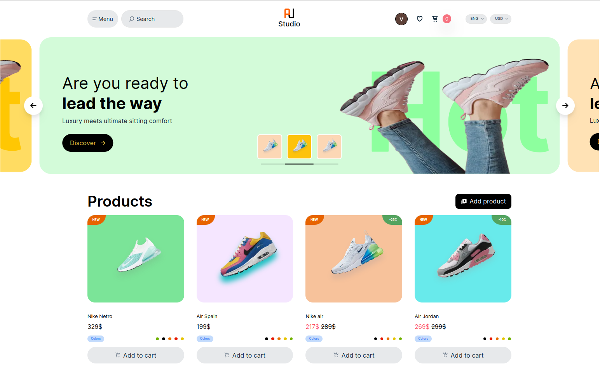

# AJ STUDIO

## Technologies

Next.js & React: Fast, responsive, and interactive UI.

Tailwind CSS: Utility-first CSS framework for styling.

Prisma: Simplified database management and querying.

PostgreSQL: Reliable and robust database.

Stripe: Seamless payment integration.

Authentication: Supports GitHub and Google sign-in.



## Description

aj-studio is a modern web application built with Next.js and React for the frontend, Prisma as an ORM for database management, PostgreSQL as the database, and Stripe for payment processing. This project aims to provide a robust and scalable solution for selling.

## Environment Variables

### Database Configuration

DATABASE_URL=`postgresql://<username>:<password>@<host>:<port>/<database>`

### Authentication Configuration

NEXTAUTH_SECRET=`<your-secret>`

NEXT_PUBLIC_BASE_URL=`<your-url>`

### Edge Store Configuration

EDGE_STORE_ACCESS_KEY=`<your-access-key>`

EDGE_STORE_SECRET_KEY=`<your-secret-key>`

### OAuth Configuration

GITHUB_CLIENT_ID=`<your-client-id>`

GITHUB_CLIENT_SECRET=`<your-client-secret>`

GOOGLE_CLIENT_ID=`<your-client-id>`

GOOGLE_CLIENT_SECRET=`<your-client-secret>`

### Stripe Configuration

STRIPE_WEBHOOK_SECRET=`<your-webhook-secret>`

STRIPE_SECRET_KEY=`<your-secret-key>`

NEXT_PUBLIC_STRIPE_PUBLISHABLE_KEY=`<your-publishable-key>`

## Getting Started

1.Clone the repository: git clone https://github.com/Vitaliy-Salinskiy/aj-studio

2.Install dependencies:

```
npm install
#or
yarn install
#or
pnpm install
#or
bun install
```

3.Set up environment variables: Create a .env file in the root of your project and add the above environment variables.

4.Run the development server:

```
npm run dev
#or
yarn dev
#or
pnpm dev
#or
bun dev
```

5.Open your browser: Go to http://localhost:3000
